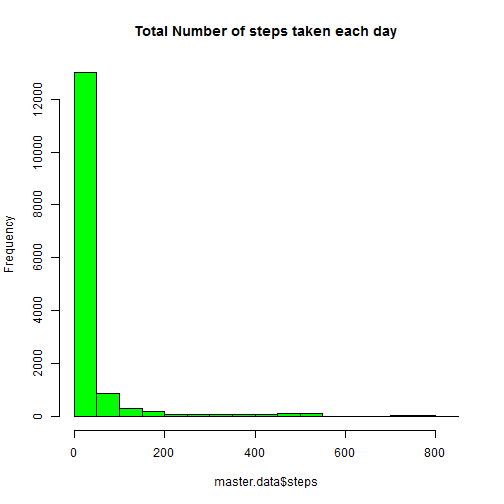
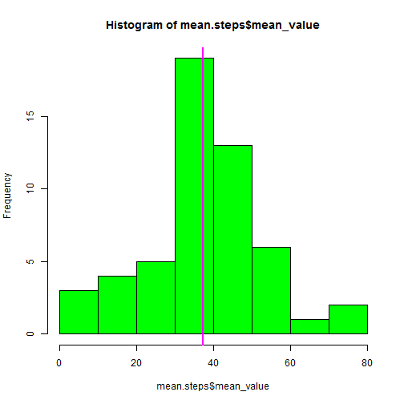
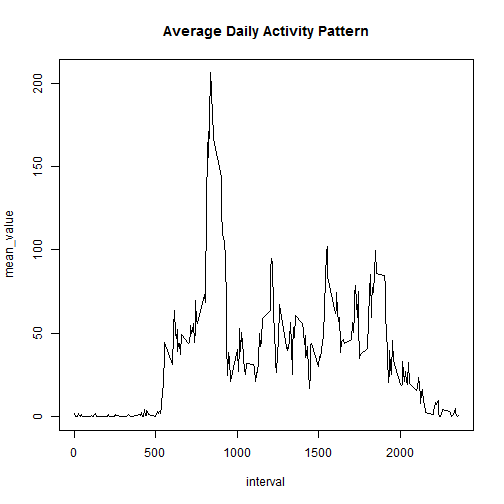
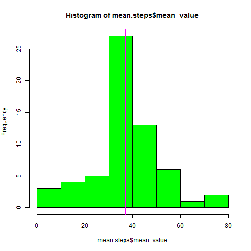

## Loading and preprocessing the data

```r
master.data.all <- read.csv("activity.csv", stringsAsFactors=FALSE, header=TRUE)
master.data <- na.omit(master.data.all)
```

## Histogram of total number of steps taken each day

```r
hist(master.data$steps,col="green")
```

 


## What is mean total number of steps taken per day?

```r
library(plyr)
```

```
## Warning: package 'plyr' was built under R version 3.1.2
```

```r
mean.steps <- ddply(master.data, .(date), summarize, mean_value=mean(steps))
hist(mean.steps$mean_value,col="green")
abline(v=median(mean.steps$mean_value),col="magenta",lwd=2)
```

 


## What is the average daily activity pattern?

```r
mean.interval <- ddply(master.data, .(interval), summarize, mean_value=mean(steps))
with(mean.interval, plot(interval,mean_value,main="Average Daily Activity Pattern",type="l"))
```

 


The 5 minute interval on average across all the days in the dataset that contains the maximum number of steps is 835

## Imputing missing values


Total number of missing values in the dataset is 2304


```r
impute.mean <- function(x) replace(x, is.na(x), mean(x, na.rm = TRUE))
master.data.all <- ddply(master.data.all, ~ interval, transform, steps = impute.mean(steps))

mean.steps <- ddply(master.data.all, .(date), summarize, mean_value=mean(steps))
hist(mean.steps$mean_value,col="green")
abline(v=median(mean.steps$mean_value),col="magenta",lwd=2)
```

 


## Are there differences in activity patterns between weekdays and weekends?


```r
master.data.all$dayframe <- ifelse(weekdays(as.Date(master.data.all$date))%in%c("Saturday","Sunday"),"Weekend","Weekday")
mean.dayframe <- ddply(master.data.all, .(interval), summarize, mean_value=mean(steps))
with(mean.dayframe, plot(interval,mean_value,main="Average Daily Activity Pattern",type="l"))
```

 


